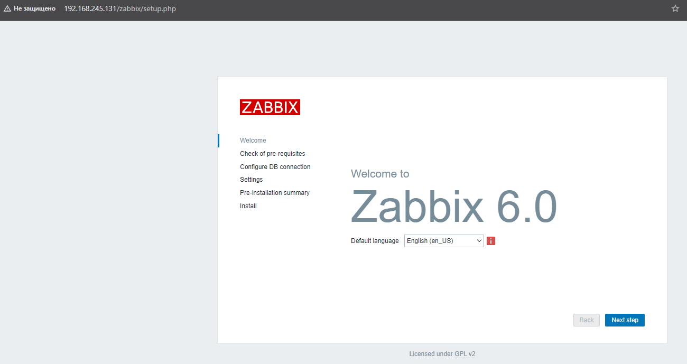
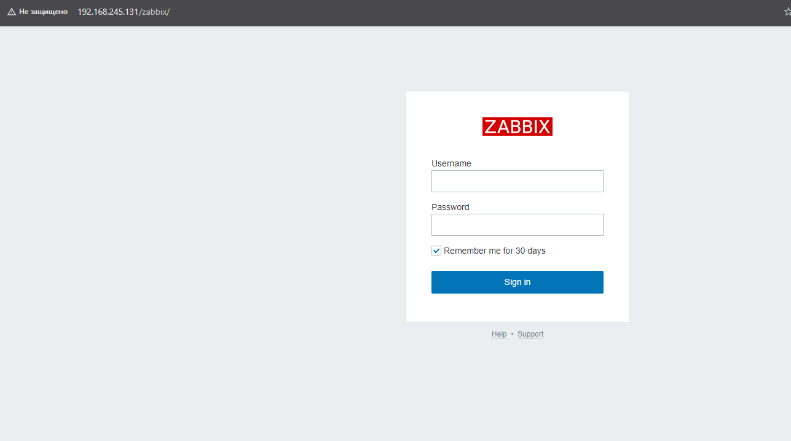
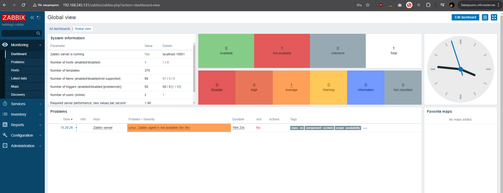
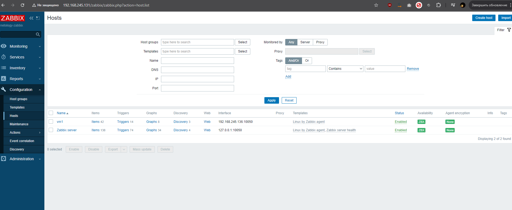
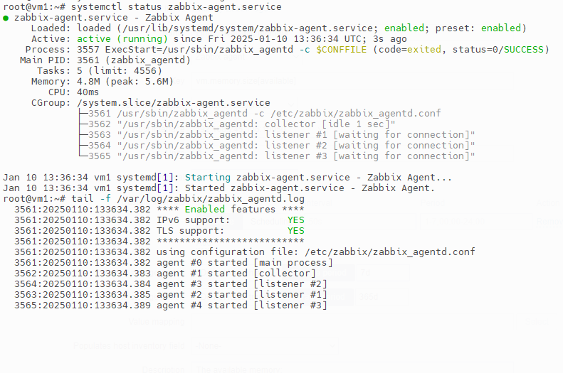
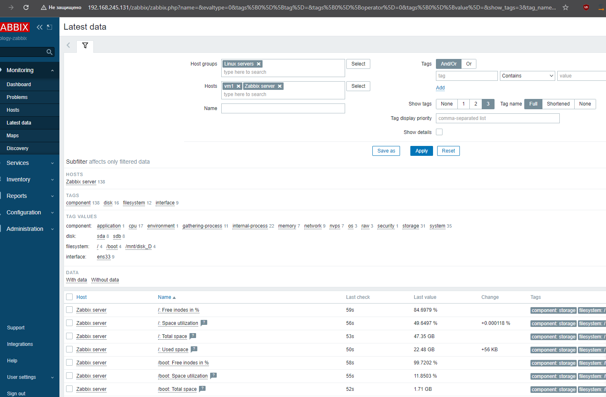
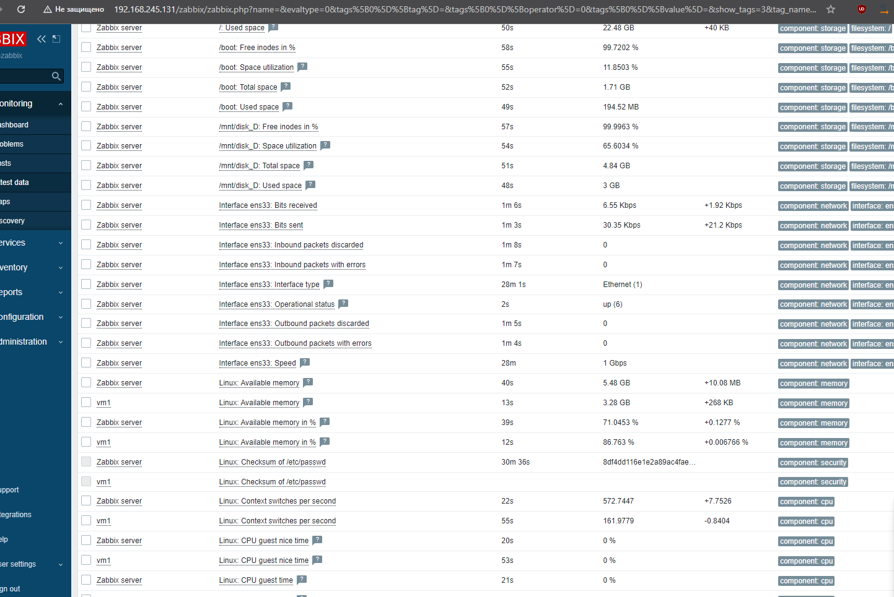

# Задание 1

## Установите Zabbix Server с веб-интерфейсом.

1. Выполняя ДЗ, сверяйтесь с процессом отражённым в записи лекции.
2. Установите PostgreSQL. Для установки достаточна та версия, что есть в системном репозитороии Debian 11.
3. Пользуясь конфигуратором команд с официального сайта, составьте набор команд для установки последней версии Zabbix с поддержкой PostgreSQL и Apache.
4. Выполните все необходимые команды для установки Zabbix Server и Zabbix Web Server.
### В качестве ответа:
1. Прикрепите в файл README.md скриншот авторизации в админке.
2. Приложите в файл README.md текст использованных команд в GitHub
#### Команды:
    sudo -i
    apt update
    apt install postgresql -y
    wget https://repo.zabbix.com/zabbix/6.0/ubuntu/pool/main/z/zabbix-release/zabbix-release_latest_6.0+ubuntu24.04_all.deb
    dpkg -i zabbix-release_latest_6.0+ubuntu24.04_all.deb
    apt update
    apt install zabbix-server-pgsql zabbix-frontend-php php8.3-pgsql zabbix-apache-conf zabbix-sql-scripts
    sudo -u postgres createuser --pwprompt zabbix
    sudo -u postgres createdb -O zabbix zabbix
    zcat /usr/share/zabbix-sql-scripts/postgresql/server.sql.gz | sudo -u zabbix psql zabbix
    sed -i 's/# DBPassword=/DBPassword=123456789/g' /etc/zabbix/zabbix_server.conf
    systemctl restart zabbix-server apache2
    systemctl enable zabbix-server apache2

#### Инициализация:

#### Окно авторизации в админку:

#### Админка:

# Задание 2

## Установите Zabbix Agent на два хоста.

1. Выполняя ДЗ, сверяйтесь с процессом отражённым в записи лекции.
2. Установите Zabbix Agent на 2 вирт.машины, одной из них может быть ваш Zabbix Server.
3. Добавьте Zabbix Server в список разрешенных серверов ваших Zabbix Agentов.
4. Добавьте Zabbix Agentов в раздел Configuration > Hosts вашего Zabbix Servera.
5. Проверьте, что в разделе Latest Data начали появляться данные с добавленных агентов.
### В качестве ответа:
1. Приложите в файл README.md скриншот раздела Configuration > Hosts, где видно, что агенты подключены к серверу

2. Приложите в файл README.md скриншот лога zabbix agent, где видно, что он работает с сервером

3. Приложите в файл README.md скриншот раздела Monitoring > Latest data для обоих хостов, где видны поступающие от агентов данные.

4. Приложите в файл README.md текст использованных команд в GitHub
    sudo -i
    apt update
    wget https://repo.zabbix.com/zabbix/6.0/ubuntu/pool/main/z/zabbix-release/zabbix-release_latest_6.0+ubuntu24.04_all.deb
    dpkg -i zabbix-release_latest_6.0+ubuntu24.04_all.deb
    apt update
    apt install zabbix-agent -y
    sed -i 's/Server=127.0.0.1/Server=192.168.245.131/g' /etc/zabbix/zabbix_agentd.conf
    systemctl restart zabbix-agent.service
    systemctl status zabbix-agent.service

# Задание 3 со звёздочкой*

    Установите Zabbix Agent на Windows (компьютер) и подключите его к серверу Zabbix.
### В качестве ответа:
    Приложите в файл README.md скриншот раздела Latest Data, где видно свободное место на диске C:

